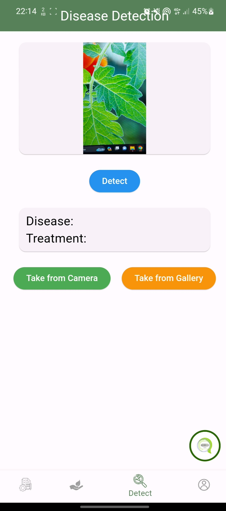

# Plant Disease Detection and Treatment App: "AgriCure"

AgriCure is a comprehensive mobile application developed as part of an AI mini project with my colleagues for detecting plant diseases and recommending treatments. This app features a Flutter-based frontend and a Node.js and Express.js backend. It uses MongoDB for primary data storage and Firebase for enhanced functionality, including IoT integration for real-time data monitoring. The AI component of the project is responsible for detecting plant diseases through the mobile application.

## Features

- **Disease Detection:** Leverages AI-powered FastAPI to identify plant diseases from captured images.
- **Treatment Recommendations:** Offers actionable treatment advice based on detected plant diseases.
- **IoT Integration:** Employs Firebase for real-time monitoring of soil moisture, air humidity, and temperature.
- **Chatbot AI:** Provides a conversational interface for user queries and support.
- **User-friendly Interface:** Offers a seamless and intuitive mobile app experience.

## Technologies Used

- **Frontend:** Flutter
- **Backend:** Node.js, Express.js
- **Database:** MongoDB
- **Firebase:** IoT Functions
- **AI Integration:** Python FastAPI
- **Chatbot:** Integrated AI for user interaction

## Chatbot Integration

Configure and integrate the AI chatbot for user interactions. Ensure that the chatbot is connected to the backend for handling user queries.

## Screenshots
Here are some screenshots of the AgriCure application:
**Home Interface**

**Farm Management**

**Plant Monitoring IOT**

**Plant Disease Detection with AI**

**AI Chatbot**

